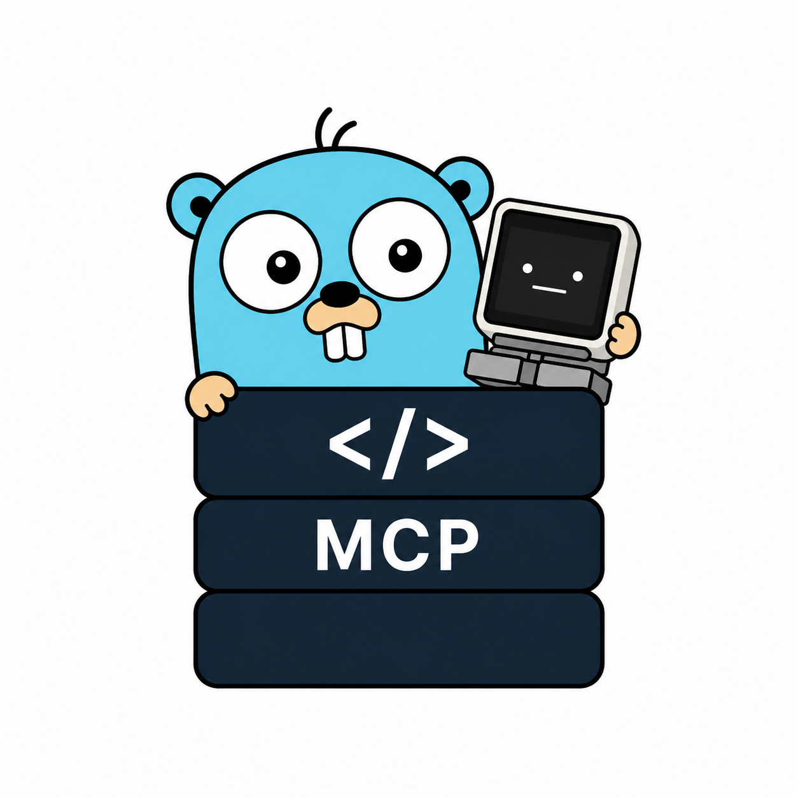
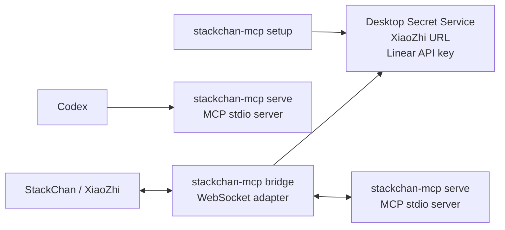

# StackChan MCP

<p align="center">
  
</p>

This repository contains one local `stackchan-mcp` binary for StackChan/XiaoZhi,
Codex MCP stdio, and issue-work commands.

## What This MCP Does

StackChan MCP is a local automation bridge for voice-driven development work.
It gives StackChan and Codex a small, focused tool surface:

- `Linear:` list teams and fetch ticket details by issue key.
- `Project discovery:` find local Git repositories under `~/Dev`.
- `Worktrees:` create or reuse isolated Git worktrees for Linear tickets.
- `tmux:` create, validate, repair, or reuse ticket sessions.
- `Codex handoff:` start Codex in one pane and queue a guarded prompt.
- `Completion notes:` write status messages to `reports/CONVO_FEED.log`.
- `Web search:` search the web or a specific public HTTP/HTTPS page.
- `Diagnostics:` verify MCP connectivity with a small greeting tool.

The main workflow is:

```text
Say "start STACHA 2" to StackChan
  -> Linear issue STACHA-2 is loaded
  -> the team key is mapped to a repo query
  -> a matching Git repo is resolved under ~/Dev
  -> a git worktree is created or reused
  -> a tmux session is created or repaired
  -> Codex is started in pane 0
  -> a guarded implementation prompt is queued for Codex
```

Repo resolution for `start_ticket_work` works like this:

- if `repo` is passed explicitly, that value is used
- otherwise the Linear team key is mapped to a repo query
- `RIOT` maps to `riotbox`
- every other team maps to the lowercase team key, for example `STACHA` to
  `stacha`
- only direct child directories of `~/Dev` are checked
- only Git repositories or Git worktrees are considered
- exact directory name matches win over fuzzy matches
- fuzzy matching is a case-insensitive substring match on the directory name
- if there are zero matches or multiple fuzzy matches, `start_ticket_work`
  returns an error instead of guessing

It is intentionally not a general remote-control server. The exposed tool
surface is kept small and focused on local development workflows.

## How It Works

`stackchan-mcp` has three primary runtime modes:

- `setup` stores credentials in the desktop Secret Service.
- `serve` runs the MCP stdio server. Codex uses this mode directly.
- `bridge` connects to the XiaoZhi WebSocket endpoint and forwards MCP traffic
  to a local `serve` process.

It also includes CLI helpers for resolving projects, starting issue work from a
manifest, storing individual secrets, and writing completion notes.

Codex and StackChan use different paths into the same tool implementation:

```text
Codex -> stackchan-mcp serve

StackChan / XiaoZhi -> stackchan-mcp bridge -> stackchan-mcp serve
```

The bridge is only needed because XiaoZhi speaks to tools through a WebSocket
endpoint. Codex does not need the bridge because it can start the MCP server
directly over stdio.

## Layout

```text
cmd/stackchan-mcp/      binary entry point
internal/app/           CLI, XiaoZhi bridge, and MCP server orchestration
internal/issuework/     Linear ticket worktree and tmux orchestration
internal/linearclient/  Linear GraphQL client
internal/search/        Web search, page scraping, and URL safety checks
internal/secretstore/   Secret Service wrapper around secret-tool
```

## Requirements

- Go
- Git
- tmux
- Codex CLI
- `secret-tool` with a desktop Secret Service provider, such as GNOME Keyring
  or KWallet
- Linear API key
- XiaoZhi MCP WebSocket URL from the StackChan/XiaoZhi app

Secrets are stored in the desktop Secret Service, not in `.env`.

## Runtime Modes



`setup` stores credentials. `serve` is the MCP server used directly by Codex.
`bridge` is only needed for StackChan/XiaoZhi and starts `serve` in the
background.

When called without arguments, the binary uses a practical default:

- if stdin is a terminal, it starts `bridge`
- if stdin is piped, it starts `serve`

## Tools

MCP itself exposes tools as a flat list. This README groups them by purpose.

### Ticket Workflow

These are the main tools StackChan should use for issue work.

#### `start_ticket_work`

Starts one Linear ticket by team key and ticket number, for example `STACHA`
and `2`.

Inputs: `team`, `number`, optional `repo`, optional `dry_run`, optional
`start_implementation`, and optional `implementation_prompt`.

It then:

- loads the issue from Linear
- maps the team to a local repo name
- resolves the repo under `~/Dev`
- creates or reuses a Git worktree
- creates or repairs a tmux session
- starts Codex in the first pane
- starts a shell in the second pane
- queues an implementation prompt for Codex by default

If the worktree already exists, it is reused only when it belongs to the
expected repo and is on the expected branch. If a tmux session already exists,
it is reused only when its panes point at the expected worktree and the first
pane is running Codex; otherwise the tmux session is recreated.

Linear title and description are treated as untrusted issue context in the
generated Codex prompt, so issue text is not allowed to override operating
instructions.

#### `finish_issue`

Records a completion note for an issue. When a worktree path is provided, it
writes to `reports/CONVO_FEED.log` and returns a short speakable completion
message.

Inputs: `issue_key`, optional `message`, and optional `worktree_path`.

### Linear

These tools only read Linear metadata.

#### `linear_list_teams`

Lists Linear teams using the Linear API key stored in Secret Service. This is
useful for discovering the team key StackChan should use, for example `STACHA`.

Inputs: none.

### Project Discovery

These tools help map spoken project or team names to local repositories.

#### `resolve_project`

Finds matching Git repositories under `~/Dev` or validates an explicit project
path. This is useful when checking which local repo a Linear team should map to.

Inputs: `query`, either a project name such as `riotbox` or a path such as
`~/Dev/riotbox`.

When `query` is a path, it must exist and be inside a Git working tree. When it
is a name, only direct Git directories under `~/Dev` are considered. Exact name
matches are returned first; otherwise case-insensitive substring matches are
returned.

### Web Search

These tools leave the local development workflow and fetch public web content.

#### `search_internet`

Searches the web through DuckDuckGo HTML results, or searches a provided
HTTP/HTTPS page for a term. When a URL is provided, it can optionally follow
links from that page.

Inputs: `query`, optional `url`, optional `max_results`, optional
`follow_links`, optional `max_pages`, and optional `same_host_only`.

The fetcher blocks local, private, link-local, multicast, and carrier-grade NAT
addresses to avoid using the tool as an SSRF path into the local network.

### Diagnostics

These tools are mainly for checking connectivity.

#### `say_hello`

Small smoke-test tool. It returns a short greeting and is useful for checking
that StackChan or Codex can call the MCP server.

Inputs: optional `name`.

## Build And Setup

Build it first:

```bash
cd ~/Dev/stackchan-mcp
make build
```

Or install it into your Go binary path:

```bash
make install
```

If the binary is installed through `go install` or a package manager, use the
plain command name:

```bash
stackchan-mcp bridge
stackchan-mcp serve
stackchan-mcp setup
```

Run one-time setup. It stores the full URL from the StackChan/XiaoZhi app and
the Linear API key in the desktop Secret Service:

```bash
make setup
```

To force re-entry of both values:

```bash
./dist/stackchan-mcp setup --force
```

To store only one secret:

```bash
./dist/stackchan-mcp xiaozhi-store-url
./dist/stackchan-mcp linear-store-api-key
```

Daily start:

```bash
make start
```

This runs:

```bash
./dist/stackchan-mcp bridge
```

If you installed it with `make install`, this is equivalent to:

```bash
stackchan-mcp bridge
```

Package-manager installs use the same command form.

For JSON-RPC debug logs:

```bash
make debug
```

Useful direct bridge commands:

```bash
stackchan-mcp bridge --ws "wss://api.xiaozhi.me/mcp?token=..."
stackchan-mcp bridge --debug
stackchan-mcp bridge --reconnect=false
```

Keep that terminal running. The bridge starts the same binary in MCP `serve`
mode in the background.

## Codex Usage

Codex should run the MCP server in stdio mode:

```toml
[mcp_servers.stackchan]
command = "/home/markus/Dev/stackchan-mcp/dist/stackchan-mcp"
args = ["serve"]
```

If `stackchan-mcp` is installed through `go install` or a package manager, use:

```toml
[mcp_servers.stackchan]
command = "stackchan-mcp"
args = ["serve"]
```

The included `xiaozhi-mcp.json` uses the installed command form:

```json
{
  "mcpServers": {
    "stackchan": {
      "command": "stackchan-mcp",
      "args": ["serve"]
    }
  }
}
```

## StackChan Usage

Then ask StackChan something like:

```text
Use the say_hello tool and greet Markus.
```

or:

```text
Use the search_internet tool to search the web for today's OpenAI news.
```

## Ticket Workflows

The normal StackChan path is `start_ticket_work`:

```text
Use start_ticket_work for STACHA 2.
```

By default, this also sends an implementation prompt into the Codex tmux pane.
To only prepare the worktree and tmux session, pass `start_implementation=false`.

The shortcut maps known Linear teams to local repositories. For example, `RIOT`
maps to `riotbox`; otherwise the lowercase team key is used as the repo name.

For `RIOT-123`, it creates or reuses:

```text
~/Dev/riotbox-worktrees/<linear-branch-name>
tmux session: riotbox-RIOT-123
```

## Manual Issue Work

This is the lower-level CLI path. It is useful for scripted batches or manual
debugging, but it is not the normal StackChan voice workflow. StackChan should
usually call `start_ticket_work` instead.

Resolve a repo:

```bash
./dist/stackchan-mcp resolve --project riotbox
```

Dry-run a manifest:

```bash
./dist/stackchan-mcp start --manifest /path/to/manifest.json --dry-run
```

Start real worktrees and tmux sessions:

```bash
./dist/stackchan-mcp start --manifest /path/to/manifest.json
```

Finish an issue:

```bash
./dist/stackchan-mcp finish --issue RIOT-123 --message "RIOT-123 is done." --worktree ~/Dev/riotbox-worktrees/branch-name
```

Manifest file for `start --manifest`:

```json
{
  "project_path": "~/Dev/riotbox",
  "repo_name": "riotbox",
  "issues": [
    {
      "key": "RIOT-123",
      "number": 123,
      "title": "Fix audio panic",
      "url": "https://linear.app/example/issue/RIOT-123",
      "branch_name": "markus/riot-123-fix-audio-panic"
    }
  ]
}
```
