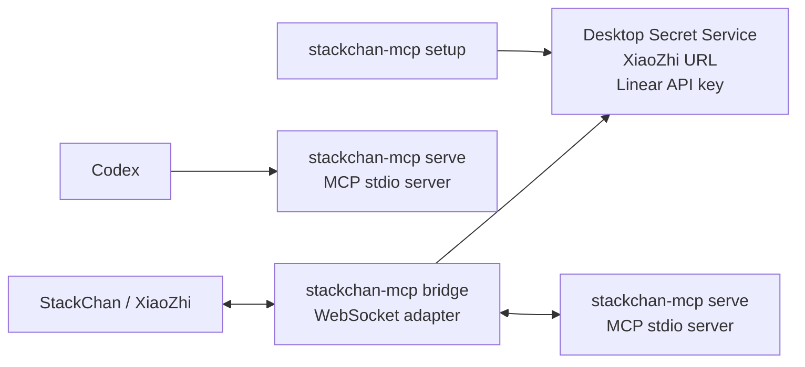

# StackChan MCP

This folder contains one local `stackchan-mcp` binary for StackChan/XiaoZhi,
Codex MCP stdio, and issue-work commands.

## Layout

```text
cmd/stackchan-mcp/      binary entry point
internal/app/           CLI, XiaoZhi bridge, and MCP server orchestration
internal/issuework/     Linear ticket worktree and tmux orchestration
internal/linearclient/  Linear GraphQL client
internal/search/        Web search, page scraping, and URL safety checks
internal/secretstore/   Secret Service wrapper around secret-tool
```

## Runtime Modes



`setup` stores credentials. `serve` is the MCP server used directly by Codex.
`bridge` is only needed for StackChan/XiaoZhi and starts `serve` in the
background.

Build it first:

```bash
cd ~/Dev/stackchan-mcp
make build
```

Or install it into your Go binary path:

```bash
make install
```

If the binary is installed through `go install` or a package manager, use the
plain command name:

```bash
stackchan-mcp bridge
stackchan-mcp serve
stackchan-mcp setup
```

Run one-time setup. It stores the full URL from the StackChan/XiaoZhi app and
the Linear API key in the desktop Secret Service:

```bash
make setup
```

Daily start:

```bash
make start
```

This runs:

```bash
./dist/stackchan-mcp bridge
```

If you installed it with `make install`, this is equivalent to:

```bash
stackchan-mcp bridge
```

Package-manager installs use the same command form.

For JSON-RPC debug logs:

```bash
make debug
```

Keep that terminal running. The bridge starts the same binary in MCP `serve`
mode in the background.
Then ask StackChan something like:

```text
Use the say_hello tool and greet Markus.
```

or:

```text
Use the current_time_vienna tool.
```

or:

```text
Use the search_internet tool to search the web for today's OpenAI news.
```

## Linear issue work sessions

Codex should fetch Linear issues via the configured Linear MCP, then pass the
resolved issue data to the local workflow tool.

Resolve a repo:

```bash
./dist/stackchan-mcp resolve --project riotbox
```

Dry-run a manifest:

```bash
./dist/stackchan-mcp start --manifest /path/to/manifest.json --dry-run
```

Start real worktrees and tmux sessions:

```bash
./dist/stackchan-mcp start --manifest /path/to/manifest.json
```

Finish an issue:

```bash
./dist/stackchan-mcp finish --issue RIOT-123 --message "RIOT-123 is done." --worktree ~/Dev/riotbox-worktrees/branch-name
```

Voice-friendly StackChan start by Linear team and ticket number:

```text
Use start_ticket_work for RIOT 123.
```

By default, this also sends an implementation prompt into the Codex tmux pane.
To only prepare the worktree and tmux session, pass `start_implementation=false`.

The shortcut maps the Linear team `RIOT` to the `riotbox` repo by default and creates:

```text
~/Dev/riotbox-worktrees/riot-123
tmux session: riotbox-RIOT-123
```

For live Linear issue details, store a Linear API key in the desktop Secret
Service. `make setup` does this, or you can run only the Linear setup:

```bash
./dist/stackchan-mcp linear-store-api-key
```

The API key is stored in the desktop Secret Service through `secret-tool`
(GNOME Keyring/KWallet compatible).

Manifest shape:

```json
{
  "project_path": "~/Dev/riotbox",
  "repo_name": "riotbox",
  "issues": [
    {
      "key": "RIOT-123",
      "number": 123,
      "title": "Fix audio panic",
      "url": "https://linear.app/example/issue/RIOT-123",
      "branch_name": "markus/riot-123-fix-audio-panic"
    }
  ]
}
```
