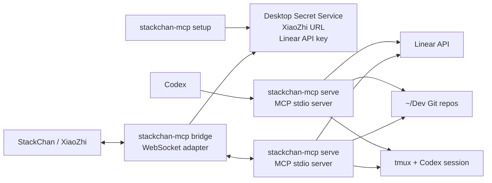

# StackChan MCP

<p align="center">
  
</p>

`stackchan-mcp` exposes a small set of local development tools to Codex and to
StackChan/XiaoZhi. The main use case is voice-triggered ticket work: StackChan
calls a tool, the tool prepares a Linear ticket worktree and tmux session, and
Codex receives the implementation prompt.

## Setup

Requirements:

- Go
- Git
- tmux
- Codex CLI
- `secret-tool` with a desktop Secret Service provider, such as GNOME Keyring
  or KWallet
- Linear API key
- XiaoZhi MCP WebSocket URL from the StackChan/XiaoZhi app

Build the binary:

```bash
cd ~/Dev/stackchan-mcp
make build
```

Optionally install it into your Go binary path:

```bash
make install
```

Store the XiaoZhi WebSocket URL and Linear API key:

```bash
make setup
```

Secrets are stored in the desktop Secret Service, not in `.env`.

## Start StackChan Bridge

StackChan/XiaoZhi needs the bridge process to be running:

```bash
make start
```

This runs:

```bash
./dist/stackchan-mcp bridge
```

Keep this terminal running. The bridge connects to XiaoZhi and starts a local
`stackchan-mcp serve` process in the background.

Useful commands:

```bash
make debug
./dist/stackchan-mcp bridge --ws "wss://api.xiaozhi.me/mcp?token=..."
./dist/stackchan-mcp bridge --reconnect=false
```

If installed with `make install`, use `stackchan-mcp` instead of
`./dist/stackchan-mcp`.

## Configure Codex

Codex does not need the bridge. It starts the MCP server directly in stdio mode:

```toml
[mcp_servers.stackchan]
command = "/home/markus/Dev/stackchan-mcp/dist/stackchan-mcp"
args = ["serve"]
```

If installed with `make install`:

```toml
[mcp_servers.stackchan]
command = "stackchan-mcp"
args = ["serve"]
```

The included `xiaozhi-mcp.json` uses the installed command form.

## Architecture



## Tools

MCP exposes tools as a flat list. They are grouped here by purpose.

### Ticket Workflow

`start_ticket_work`

Starts one Linear ticket by team key and ticket number. Example voice command:

```text
Use start_ticket_work for STACHA 2.
```

Inputs: `team`, `number`, optional `repo`, optional `dry_run`, optional
`start_implementation`, and optional `implementation_prompt`.

What it does:

- fetches the Linear issue
- resolves the local repo under `~/Dev`
- creates or reuses a Git worktree
- creates or repairs a tmux session
- starts Codex in the first pane
- starts a shell in the second pane
- queues an implementation prompt for Codex by default

Repo matching:

- explicit `repo` wins
- otherwise the Linear team key is mapped to a repo query
- `RIOT` maps to `riotbox`
- every other team maps to the lowercase team key, for example `STACHA` to
  `stacha`
- only direct Git directories under `~/Dev` are checked
- exact directory name matches win over fuzzy substring matches
- zero matches or multiple fuzzy matches return an error instead of guessing

`finish_issue`

Records a completion note for an issue. With `worktree_path`, it writes to
`reports/CONVO_FEED.log`.

Inputs: `issue_key`, optional `message`, and optional `worktree_path`.

### Linear

`linear_list_teams`

Lists Linear teams from the stored Linear API key. Use it when the spoken team
key is unknown.

### Project Discovery

`resolve_project`

Finds Git repositories under `~/Dev` or validates an explicit project path.

Inputs: `query`, either a project name such as `riotbox` or a path such as
`~/Dev/riotbox`.

### Web Search

`search_internet`

Searches DuckDuckGo HTML results or searches a provided public HTTP/HTTPS page.
When a URL is provided, it can optionally follow links from that page.

Inputs: `query`, optional `url`, optional `max_results`, optional
`follow_links`, optional `max_pages`, and optional `same_host_only`.

### Diagnostics

`say_hello`

Returns a short greeting to verify that StackChan or Codex can call the MCP
server.

## More Docs

- [Manifest workflow](docs/manifest.md)
- [Internals](docs/internals.md)
